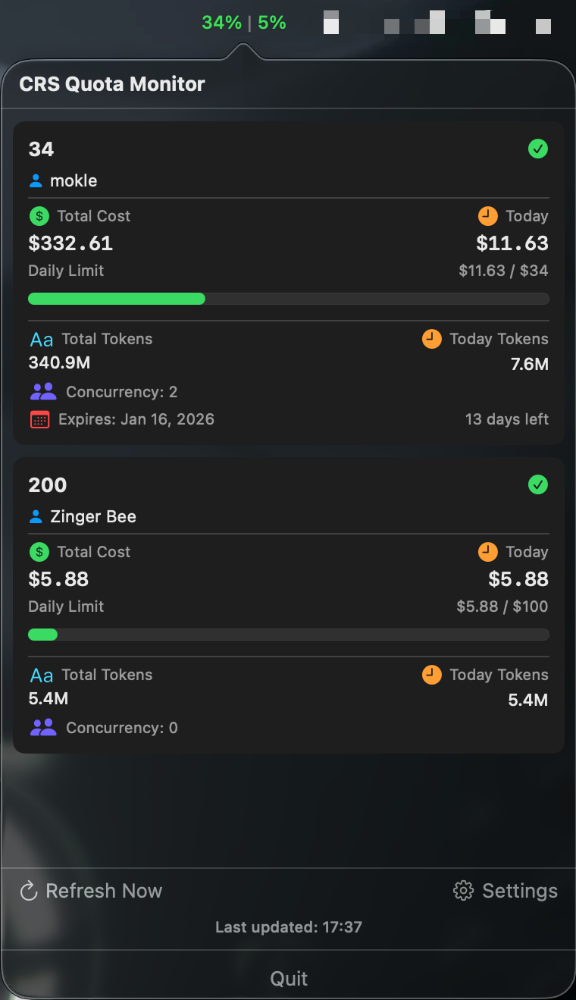

# CRS Quota

Language: 🇺🇸 English | [🇨🇳 简体中文](./README.zh-CN.md)

A macOS menu bar app for monitoring claude-relay-service API usage quota.

## Screenshot

## Features

- **Menu Bar Display** - Click the icon to view statistics, shows daily limit percentage
- **Multi-Account Support** - Configure multiple API endpoints
- **Real-time Data** - Display costs, token usage, expiration time, etc.
- **Auto Refresh** - Updates every 5 minutes, supports manual refresh
- **Quick Access** - One-click to open admin page in browser

## Displayed Data

- User name, account status
- Total cost / Today's cost
- Daily limit progress bar
- Total tokens / Today's tokens
- Concurrency limit, expiration date and remaining days

## Requirements

- macOS 13.0+
- Xcode 15.0+

## How to Run

1. Open `crs-quota.xcodeproj`
2. Click **Run** (Cmd + R)
3. Click the menu bar icon, go to Settings to add API configuration

## Configuration

- **Name** - Configuration name
- **Base URL** - API address (e.g., `http://127.0.0.1:3000`)
- **API ID** - User API ID
- **Show in Menu Bar** - Whether to display this config's usage percentage in menu bar

## Tech Stack

- Swift / SwiftUI
- async/await for asynchronous requests
- UserDefaults for persistent storage
